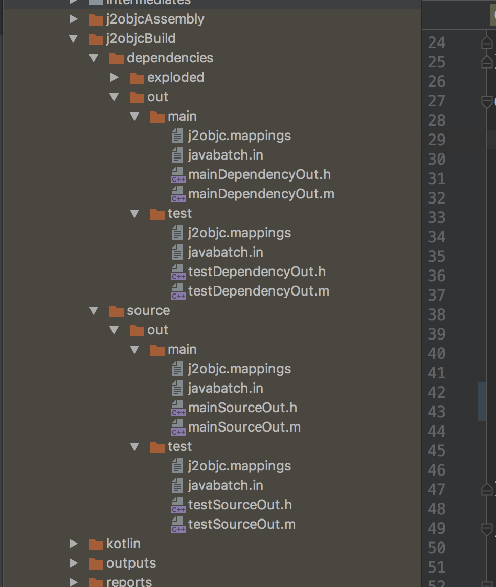

# Dependencies

> See other tutorials: [Basic Quick Start](/basicquickstart.html), [Testing](/basicsamples/testing.html)

Let's run through the basics of adding dependencies to a J2objc Gradle project.

The plugin defines 3 configurations, and can handle two different archive formats.

## Configurations

+ **j2objc** Standard dependency for main source builds. Will carry forward transitive dependencies.
+ **j2objcOnly** Similar to j2objc, but only for this project. Will not carry forward if this is used as a dependency.
+ **testJ2objc** Only available to the test build.

In general, you add dependencies in parallel to similar Java dependencies.

```groovy
implementation 'com.google.code.gson:gson:2.6.2'
j2objc 'org.j2objcgradle.com.google.code.gson:gson:2.6.2.7'
```

Notice two things above: the j2objc dependency has the prefix 'org.j2objcgradle'. This
is to be totally clear that the dependency isn't published by the original author. All
dependencies we publish have a prefix like that. Also, at the end, the extra version number.
This lets us release point versions from the common base version.

To add Junit dependencies for testing, we've done the following:

```groovy
testImplementation 'junit:junit:4.12'
testJ2objc 'org.j2objcgradle.junit:junit:4.12.0'
```

We'll explain some 'j2objcOnly' samples later.

## Archive Format

The J2objc Gradle plugin defines its own dependency format. It is a standard zip archive,
with the extension 'dop', and internally a 'java' folder for Java source, and optionally a
'src' folder to place C/C++/Objective-C/Swift sources to directly copy to the build directory.

The dependencies we publish all use this format.

Alternatively, you can reference sources jar archives. Open source Java projects often publish
Java source jars along with their class file jars, in a separate archive with the 'sources'
classifier. You can add these dependencies as follows.

```groovy
testImplementation 'com.google.guava:guava:19.0'
testJ2objc 'com.google.guava:guava:19.0:sources'
```

Although on the surface this seems simpler, there are two primary reasons why you'd want to
create j2objc-specific dependencies:

+ Transitive Dependencies - Maven-based dependency archives don't support transitive dependencies for
secondary archives, which the sources jar generally is. You'll need to explicitly list all
dependencies of the archive.
+ J2objc Specific Changes - Java projects generally translate well, but anything significant will often
have some J2objc-specific modifications, even if just some annotations. Bigger projects, and anything
Android specific, generally needs some modification.

Guava is kind of a special case. It does not depend on anything else, and it is J2objc-aware. There are a
few J2objc annotations included in the source. It'll "just work" out of the box.

## Output

Once dependencies are configured, run './gradlew j2objcBuild'. Our j2objc configuration outputs multiple
Java input files into single Objective-C output files. There are 4 sets of Objective-C source files produced.
One each for main source and dependencies, and one each for test source and dependencies.



In this example, gson will be in 'build/j2objcBuild/dependencies/out/main/mainDependencyOut.&#42;' and junit
and Guava will be in 'build/j2objcBuild/dependencies/out/test/testDependencyOut.&#42;'.

## Doppl Helpers

There is a testing support package also included in the dependency list.

```groovy
testImplementation "co.doppl.lib:androidbasetest:0.9.0"
testJ2objc "co.doppl.lib:androidbasetest:0.9.0.0"
```

Most of this platform can be ignored for now, but to help with testing, we're using
co.touchlab.doppl.testing.DopplJunitTestHelper and passing in a list of tests to run.

That list of tests is generated by 'j2objcBuild' and output in a file called 'j2objcTests.txt'.

```swift
import UIKit
import testj2objclib

class ViewController: UIViewController {
    override func viewDidLoad() {
        super.viewDidLoad()
        CoTouchlabDopplTestingDopplJunitTestHelper.runResource(with: "j2objcTests.txt")
    }
}
```

Tests are set up to run in a separate target rather than in the unit tests section of the project.
We'll discuss test setup in another doc.
